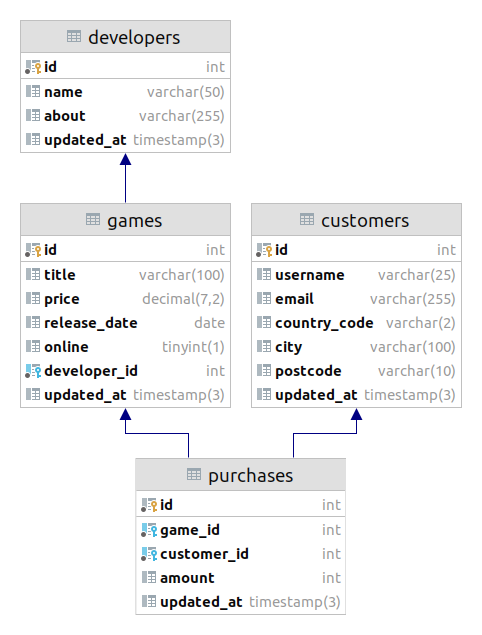

## Description

This REST API provides CRUD operations to work with a simple game store representation. The
`Developer`, `Game`, `Customer` and `Purchase` entities are resources. Cascading deletion is
supported between `Developer` and `Game`, and between `Customer` and `Purchase`.

The implementation demonstrates approaches to data transfer, fields filtering, validation,
customizing queries for JPA repositories, error handling, etc.

### ER Model



### Headers

All POST and PUT methods require the `Content-Type` request header to contain "application/json".

### Status Codes

The following status codes are possible:

| Status Code | HTTP Method | Description |
|-------------|-------------|-------------|
| 200 (OK) | GET | Resource was successfully fetched |
| 201 (Created) | POST | Resource created successfully |
| 204 (No Content) | PUT, DELETE | Request completed but nothing was returned |
| 400 (Bad Request) | POST, PUT | Handler not found, incorrect JSON format, validation error or constraint violation |
| 404 (Not Found) | GET, POST, PUT | Unable to find resource or invalid foreign key |
| 415 (Unsupported Media Type) | POST, PUT | Media format of the requested data is not supported |

### Errors

Each error response contains mandatory `status` and `message` fields. Optional `error` field
describes details. Example of responses with description of errors:

```json
{
    "status": "UNSUPPORTED_MEDIA_TYPE",
    "message": "Content type 'text/plain' not supported"
}
```

```json
{
    "status": "BAD_REQUEST",
    "message": "Validation failed. Error count: 1",
    "errors": [
        {
            "message": "Name can't be blank",
            "field": "name"
        }
    ]
}
```

## Features

This example uses the following features:

- H2 memory database, console available at localhost:8080/h2-console;
- database schema creation and populating with data is done through SQL scripts;
- all many-to-one relationships are lazy loaded;
- parent entity is loaded when called method with the appropriate entity graph setting;
- custom queries for Spring Data JPA;
- request body is filtered through JSON view or DTO;
- request body is validated;
- custom validation annotations;
- data from server to client is filtered through JSON view or JPA projection;
- each response has a corresponding status code;
- global exception handling point.

## Note

### DTO

DTO - data transfer object that has no behavior other than storing, retrieving, serializing and
deserializing its own data. DTO can be used when we receive or send data to a client with fields
that are not present in the entity.

Some DTOs can be replaced with records (Java 16 feature). This allows to get rid of unnecessary
boilerplate code.

### JSON View

JSON views allow filtering fields during serialization/deserialization using `@JsonView` annotation.
This can be useful when you want to restrict the client from interacting with a specific set of fields.

`@JsonView` can be applied at class and field levels. If `@JsonView` annotates a class, then all
non-annotated fields will be assigned to the specified view. In addition, `@JsonView` at the class
level will propagate the behavior to all descendant classes.

JSON view can extend another view.

### Custom Serializers and Deserializers

If the number of `@JsonView` annotations is confusing, you can always implement your own JSON
serializer/deserializer. To do this, you must write a class annotated with `@JsonComponent` and
extending `JsonSerializer` or `JsonDeserializer`.

### JPA Projection

JPA projections help to fetch only those properties from the database that are specified in the
projection. Projection can be either an interface or a DTO.

In the first case, only the required properties will be retrieved from the database:

```java
public interface GameRepository extends JpaRepository<Game, Long> {
    Page<GameSummaryProjection> findAllGameSummaryProjectionBy(Pageable pageable);
}
```

In the second case, all properties will be fetched from the database, but only the specified will
be written to the DTO. To avoid fetching all properties, you can write your own query (`@Query`
annotation):

```java
public interface GameRepository extends JpaRepository<Game, Long> {
    @Query("SELECT new com.example.domain.dto.GameSummary(g.id, g.title, g.updatedAt) FROM Game g")
    Page<GameSummaryDto> findAllGameSummaryDtoBy(Pageable pageable);
}
```

Also, you can't use nested projection with DTOs.

Note, that even if your query doesn't have "By" in the method name, you must always add it,
otherwise the query will not be able to build.

### Entity Graph

Thanks to entity graph, you can choose at runtime to load related entities or not. To do this, you
have to set the `FetchType.LAZY` strategy and annotate the repository method with `@EntityGraph`. The
`@EntityGraph` annotation needs to be passed the name of the field that represents the related
entity that you want to load.

### Problems with @Data Entity

Entities aren't annotated with `@Data` because it generates incorrect implementation of the
`equals` and `hashCode` methods. Instead, to reduce boilerplate code, each entity is annotated
with `@Getter` and `@Setter` and, if necessary, `@NoArgsConstructor` and
`@AllArgsConstructor`.

### @Transactional

`@Transactional` can be applied to a service method. Sometimes this allows you to turn several
database queries into one (via `JOIN`). It also sometimes cancels unnecessary database queries. For
example, if we retrieve an object, leave the field values unchanged, and then try to update, the
statement will be ignored.

## Run the Application

To run the application, use the following command in a terminal window:

```
./mvnw spring-boot:run
```
